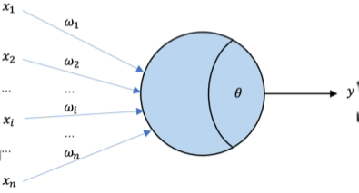
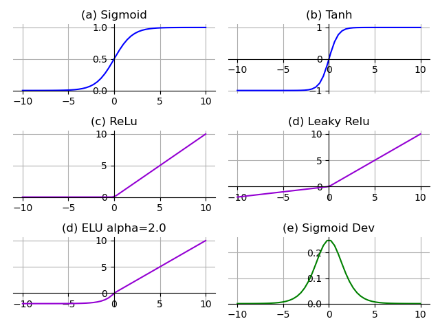

# 全连接神经网络

## 感知机模型

神经元的建模，是将输入值映射到输出值的一个数学函数。有
$$
x_{1}，x_{2}，x_{3}...x_{n}
$$
n个输入值，对应权重
$$
w_{1}，w_{2}，w_{3}...w_{n}
$$
输出为y。即
$$
y = f(\sum_{i=0}^{n}w_{i}x_{i}  )
$$


## 激活函数

激活函数（Activation Function）是一种添加到人工神经网络中的函数，旨在帮助网络学习数据中的复杂模式。在神经元中，输入的input经过一系列加权求和后作用于另一个函数，这个函数就是这里的激活函数**。

作用：给神经元引入非线性元素，使得神经网络可以逼近其他的任何非线性函数

### Softmax

用于多分类，对于长度为K的任意实向量，Softmax可以将其压缩为长度K，值在(0,1)内且向量元素总和为1的实向量。
$$
f(x_{i})=\frac{e^{x_{i}}}{\sum_{j=1}^{k}e^{x_{j}}}
$$
优点：将输入值转为概率分布，非常适合多分类

缺点：

- 在零点不可微；
- 负输入的梯度为零，这意味着对于该区域的激活，权重不会在反向传播期间更新，因此会产生永不激活的死亡神经元。

### sigmoid

（S型生长曲线）
$$
f(x)=\frac{1}{1+e^{-x}}\\
f'(x)=f(x)(1-f(x))
$$
优点:

1. 将很大范围内的输入特征值压缩到0 – 1之间，使得在深层网络中可以保持数据幅度不会出现较大的变化;
2. 在物理意义上最为接近生物神经元;
3. 根据输出范围，该函数适用于将**预测概率**作为输出的模型;

缺点:

1. **梯度消失**：当输入趋近 0 和 1的时候，变化率基本为常数，即变化非常小，进而导致梯度接近于0，无法执行反向传播
2. **收敛速度较慢**：梯度可能会过早消失，进而导致收敛速度较慢。


### Tanh

(双曲正切)
$$
f(x)=tanh(x)=\frac{2}{1-e^{-2x}}-1\\
f'(x)=1-f^{2}
$$


tanh 的输出间隔为 1，并且整个函数以 0 为中心，比sigmoid函数具有更广的范围。

Tanh 函数也会有**梯度消失**的问题

### Relu

线性整流函数(Rectified Linear Unit,ReLU)，在输入大于 0时，直接输出该值;在输入小于等于 0时，输出 0。其作用在于增加神经网络各层之间的非线性关系。
$$
f(x)=max(0,x)
$$
优点：

1. 相较于sigmoid函数以及Tanh函数来看，在输入为正时，Relu函数不存在饱和问题，即解决了梯度消失问题，使得深层网络可训练;
2. 计算速度非常快，只需要判断输入是否大于0值;
3. 收敛速度远快于sigmoid以及Tanh函数;

缺点：

1. Relu函数的输出也不是以0为均值的函数;
2. 存在Dead Relu Problem，即某些神经元可能永远不会被激活，进而导致相应
   参数一直得不到更新，产生该问题主要原因包括参数初始化问题以及学习率设置过
   大问题;
3. 当输入为正值，导数为1，在“链式反应”中，不会出现梯度消失，但梯度下降
   的强度则完全取决于权值的乘积，如此可能会导致梯度爆炸问题。

总结：

| 函数       |        图像                            | 优点                             | 缺点                                    |
| ---------- | ------------------------------------------------------------ | -------------------------------- | --------------------------------------- |
| sigmoid    |  | 容易梯度下降                     | 容易梯度消失                            |
| Tanh       |  | 比sigmoid函数具有更广的范围      | 容易梯度消失                            |
| Relu       |  | 解决了梯度消失，计算和收敛速度快 | 输入值小于0时，导数为0，有Dead Relu问题 |
| Leaky ReLU |                                                              | 可以避免出现“死神经 元”          | 参数α需要手动调整                       |
| RLU        |                                                              |                                  |                                         |
|            |                                                              |                                  |                                         |




## 代码绘制


```
import matplotlib.pyplot as plt
import numpy as np

x = np.linspace(-10, 10)
# 绘制sigmoid图像
fig = plt.figure()
y_sigmoid = 1 / (1 + np.exp(-x))
ax = fig.add_subplot(321)
ax.plot(x, y_sigmoid, color='blue')
ax.grid()
ax.set_title('(a) Sigmoid')
ax.spines['right'].set_color('none')  # 去除右边界线
ax.spines['top'].set_color('none')  # 去除上边界线
ax.spines['bottom'].set_position(('data', 0))
ax.spines['left'].set_position(('data', 0))

# 绘制Tanh图像
ax = fig.add_subplot(322)
y_tanh = (np.exp(x) - np.exp(-x)) / (np.exp(x) + np.exp(-x))
ax.plot(x, y_tanh, color='blue')
ax.grid()
ax.set_title('(b) Tanh')
ax.spines['right'].set_color('none')  # 去除右边界线
ax.spines['top'].set_color('none')  # 去除上边界线
ax.spines['bottom'].set_position(('data', 0))
ax.spines['left'].set_position(('data', 0))

# 绘制Relu图像
ax = fig.add_subplot(323)
y_relu = np.array([0 * item if item < 0 else item for item in x])
ax.plot(x, y_relu, color='darkviolet')
ax.grid()
ax.set_title('(c) ReLu')
ax.spines['right'].set_color('none')  # 去除右边界线
ax.spines['top'].set_color('none')  # 去除上边界线
ax.spines['bottom'].set_position(('data', 0))
ax.spines['left'].set_position(('data', 0))

# 绘制Leaky Relu图像
ax = fig.add_subplot(324)
y_relu = np.array([0.2 * item if item < 0 else item for item in x])
ax.plot(x, y_relu, color='darkviolet')
ax.grid()
ax.set_title('(d) Leaky Relu')
ax.spines['right'].set_color('none')  # 去除右边界线
ax.spines['top'].set_color('none')  # 去除上边界线
ax.spines['bottom'].set_position(('data', 0))
ax.spines['left'].set_position(('data', 0))

# 绘制ELU图像
ax = fig.add_subplot(325)
y_elu = np.array([2.0 * (np.exp(item) - 1) if item < 0 else item for item in x])
ax.plot(x, y_elu, color='darkviolet')
ax.grid()
ax.set_title('(d) ELU alpha=2.0')
ax.spines['right'].set_color('none')  # 去除右边界线
ax.spines['top'].set_color('none')  # 去除上边界线
ax.spines['bottom'].set_position(('data', 0))
ax.spines['left'].set_position(('data', 0))

ax = fig.add_subplot(326)
y_sigmoid_dev = y_sigmoid * (1 - y_sigmoid)
ax.plot(x, y_sigmoid_dev, color='green')
ax.grid()
ax.set_title('(e) Sigmoid Dev')
ax.spines['right'].set_color('none')  # 去除右边界线
ax.spines['top'].set_color('none')  # 去除上边界线
ax.spines['bottom'].set_position(('data', 0))
ax.spines['left'].set_position(('data', 0))

plt.tight_layout()
plt.savefig('Activation.png')
plt.show()
```
