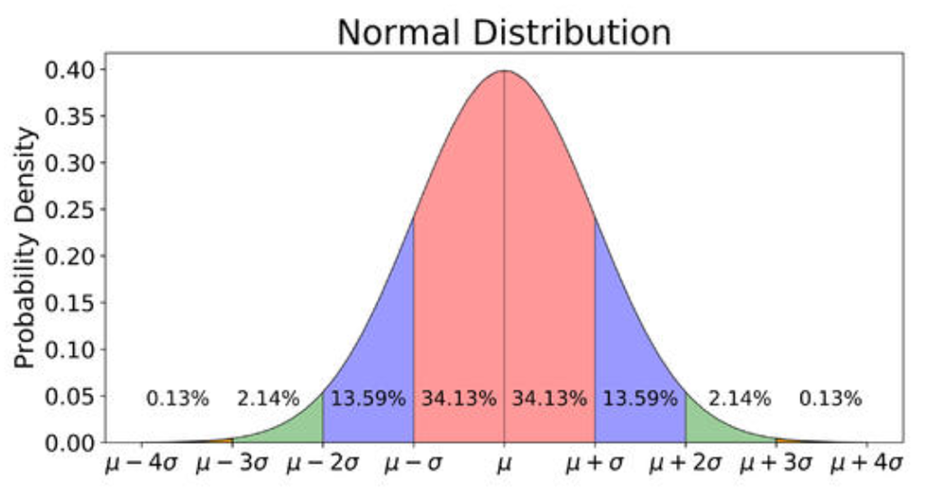
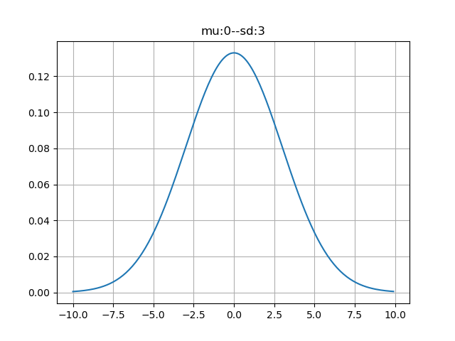

[TOC]

# 余弦相似度与欧氏距离

余弦相似度：通过计算两个向量的夹角余弦值评估相似性，取值范围[-1, 1]

>值越接近1，说明夹角越小，两向量越相似。
>
>值越接近-1，两向量的方向越相反

欧氏距离：m维空间中两个点的真实距离。

> 值越小，说明两点距离越近，相似度越高

$$
d = \sqrt{\sum_{i=1}^{n}(x_i-y_i)^2 } 
$$

# 概率定义

## 基础公式

加法原理：某事件有$N$类方式完成，第一类方式可由$m$种方法完成，第二类方式可由$n$种方法来完成，则这件事可由 $m + n$ 种方法来完成。则$P(A+B)=P(A)+P(B)$

乘法原理：某件事由两个步骤来完成，第一个步骤可由$m$种方法来完成，第二个步骤可由$n$种方法来完成，则这件事可由 $m * n$ 种方法来完成。则$P(AB) = P(A|B)P(B)$

事件独立性：设A、B为随机事件，**若同时发生的概率等于各自发生的概率的乘积**，则A、B相互独立。$P(AB) = P(A)P(B)$

时间互斥性：设A、B为随机事件，**A或B发生的概率等于分别发生概率的和**，则A、B互斥。$P(A+B) = P(A)+P(B)$

## 条件概率和边缘概率

条件概率：事件A在事件B已经发生条件下的发生概率。$P(A|B) = P(A\cap B) / P(B)$

联合概率：既满足 A 条件，又满足 B 条件的概率。$P(A\cap B)$

边缘概率：在多元概率分布中只考虑单个概率记为 $P(X=a)$或P$(Y=b)$

全概率：复杂事件A的概率转化为在不同情况下发生的简单事件的概率的求和。$p(A)=\sum_{i}P(A|B_{i})P(B_i)$

## 期望和方差

期望：数学期望（或均值，亦简称期望）是试验中每次可能结果的概率乘以其结果的总和。它反映随机变量平均取值的大小。$E(f(x))=\sum_{k=1}^{n}{f(x_k)P(x_k)}$

方差：度量随机变量和其数学期望（即均值）之间的偏离程度。方差是一种特殊的期望。 $Var(x) = E((x-E(x))^2)$

# 概率分布

## 伯努利分布（0-1分布）

**Bernoulli分布**(伯努利分布，0-1分布)是单个二值随机变量分布, 单参数$\phi$∈[0,1]控制,$\phi$给出随机变量等于1的概率. 主要性质有: 
$$
\begin{align*}P(x=1) &= \phi \\P(x=0) &= 1-\phi  \\P(x=x) &= \phi^x(1-\phi)^{1-x} \\\end{align*}
$$
期望为$\phi$，方差为$\phi(1-\phi)$

**伯努利分布**适合对**离散型**随机变量建模.

```python
# 伯努利分布（0-1分布）
def coin(count):
    sum = 0
    for i in range(count):
        if random.random() >= 0.5:
            sum += 1
    return sum


count = 10000000
sum = coin(count)
print(f'正面朝上概率：{sum / count}')
```

```
正面朝上概率：0.4997909
```

## 正态分布

高斯分布，也叫正态分布(Normal Distribution), 概率度函数如下:  
$$
N(x;\mu,\sigma^2) = \frac{1}{\sigma\sqrt{2\pi}}exp(-\frac{(\mu-x)^2}{2\sigma^2} )
$$
其中, $\mu$和$\sigma$分别是均值和标准差, 中心峰值x坐标由$\mu$给出, 峰的宽度受$\sigma$控制, 最大点在$x=\mu$处取得, 拐点为$x=\mu\pm\sigma$

此外, 令$\mu=0,\sigma=1$高斯分布即简化为标准正态分布: 
$$
N(x;\mu,\sigma^2) = \frac{1}{\sqrt{2\pi}}exp( -\frac{x^2}{2} )
$$
**中心极限定理**：在自然界与生产中，一些现象受到许多相互独立的随机因素的影响，如果每个因素所产生的影响都很微小时，总的影响可以看作是服从**正态分布**的。



python代码实现：

```python
# %%
from scipy import stats
import numpy as np
import matplotlib.pyplot as plt

mean = 0
sd = 3
x = np.arange(-10, 10, 0.1)

y = stats.norm.pdf(x, mean, sd)
plt.plot(x, y)
plt.title(f'mu:{mean}--sd:{sd}')
plt.grid()
plt.show()
```



# 信息论

## 熵

**熵（entropy）指的是体系的混乱的程度**，熵越大，则混乱度越高

香农提出**信息熵**的定义：
$$
H(X)=-\sum_{i} p_ilog(pi)
$$

> 一个随机事件发生的概率越小，则发生后的信息量就越大；
> 一个随机事件的发生概率越大，则发生后的信息量也越小。


使用python计算一段字符串的熵：

```python
# 计算信息熵
def get_ent(x):
    ent = 0.0
    for i in x:
        ent += -i * np.log(i)
    return ent


# 词频统计
def get_word_frequency(words):
    word_dict = {}

    for word in words:
        if word not in word_dict.keys():
            word_dict[word] = 1
        else:
            word_dict[word] += 1
    return word_dict


words1 = 'python java php c# c++ java php c# python java python java'
word_dict = get_word_frequency(words1.split())
p = [i / np.sum(list(word_dict.values())) for i in word_dict.values()]
print(get_ent(p))

words2 = '朴素贝叶斯分类器将测试样本测1判别为好瓜'
word_dict = get_word_frequency(words2)
p = [i / np.sum(list(word_dict.values())) for i in word_dict.values()]
print(get_ent(p))
```

```
# 运行结果：
1.5171063970610272
2.9264175554979963
```

结论：信息的重复度越低，信息熵越高，表示越混乱

## 交叉熵

用于度量**两个概率分布间的差异性信息**，语言模型的性能通常用交叉熵来衡量。交叉熵引入计算语言学消岐领域，是消岐的一种较为有效的工具，是神经网络中的**损失函数**。

两个概率$p,q$，按照$p$衡量样本期望是$\sum_{i}p(i)\cdot log(\frac{1}{p{i}})$，按$q$衡量样本期望是$\sum_{i}q(i)\cdot log(\frac{1}{q{i}})$

那么交叉熵
$$
H(p,q)=\sum_{x}p(x)\cdot log(\frac{1}{q(x)})
$$
代码实现：

```python
def cross_entropy(x, y):
    x = np.float_(x)
    y = np.float_(y)
    return np.sum(x * np.log(1 / y))


def cross_entropy2(x, y):
    return torch.sum(x * torch.log(1/y))


# 两个data的shape须一致
data1 = torch.tensor([[0.3, 0.4, 0.3], [0.8, 0.1, 0.1]])
data2 = torch.tensor([[0.2, 0.1, 0.7], [0.4, 0.2, 0.2]])
ce1 = cross_entropy(data1, data2)
print(ce1)
ce2 = cross_entropy(data1, data2)
print(ce2)
ce3 = torch.nn.CrossEntropyLoss()(data1, data2)
print(ce3)
ce4 = torch.nn.functional.cross_entropy(data1, data2)
print(ce4)
# 之后直接用框架里的loss函数，无需自己定义
```

```
运行结果：
2.5657880947545113
2.5657880947545113
tensor(0.9774)
tensor(0.9774)
```

## 均方差

**均方误差（mean squared error）**，是各数据偏离**真实值**差值的平方和的平均数，也就是误差平方和的平均数。
$$
MSE = \frac{1}{n}\sum_{i=1}^{n}(Y_i-\hat{Y_{i}})^2
$$

```python
mse1 = np.mean((np.array(data1) - np.array(data2)) ** 2)
print(mse1)
mse2 = torch.mean((data1 - data2) ** 2)
print(mse2)
mse3 = torch.nn.MSELoss()(data1, data2)
print(mse3)
mse4 = torch.nn.functional.mse_loss(data1, data2)
print(mse4)
```

```
运行结果：
0.07333333
tensor(0.0733)
tensor(0.0733)
tensor(0.0733)
```

## 损失函数对比

1. 交叉熵损失函数：更适合做**分类**问题，比均方差**梯度更大、优化更快**。
2. 均方差损失函数：万能损失函数，可以做**回归和分类**。
