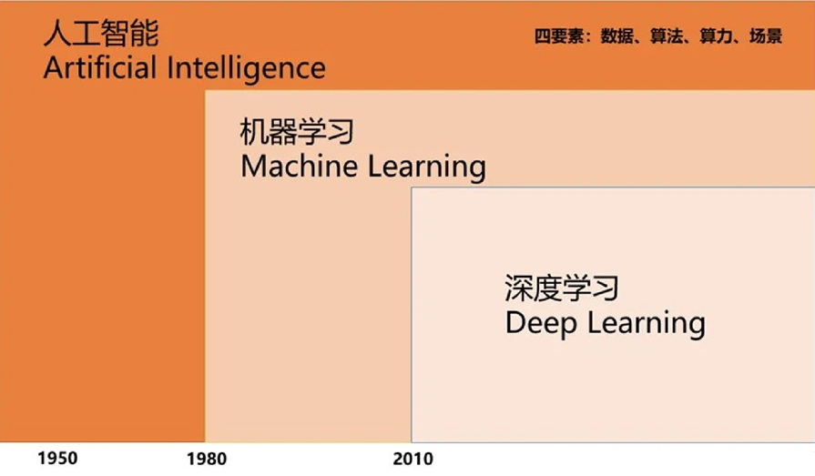
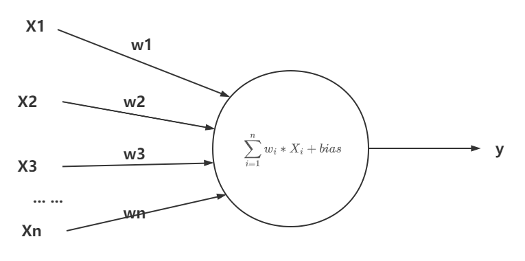
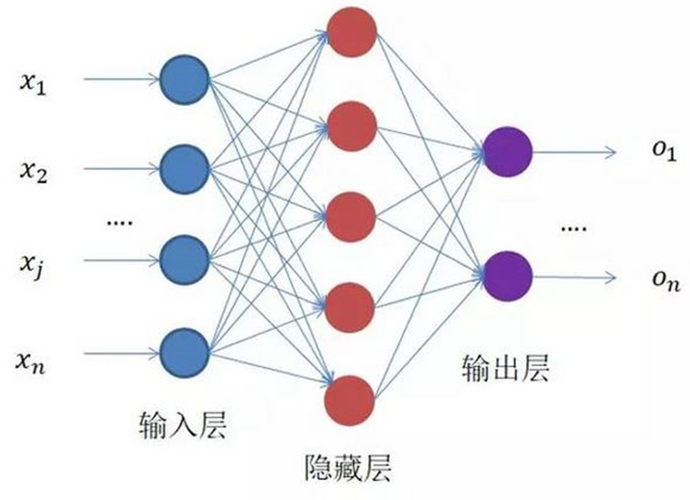
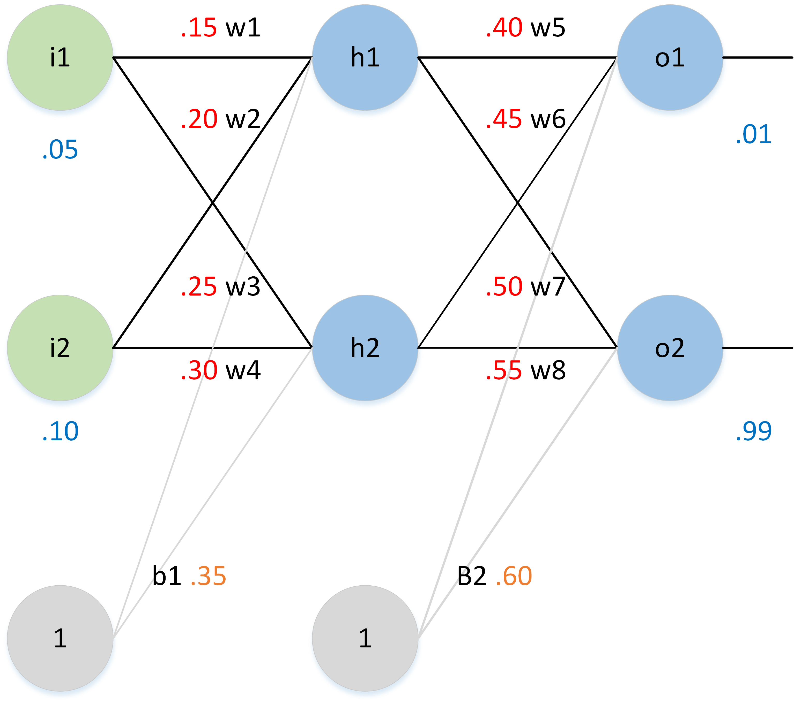
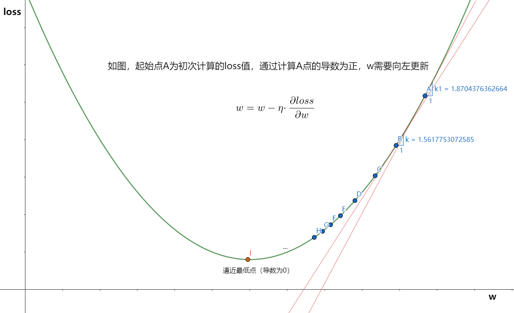
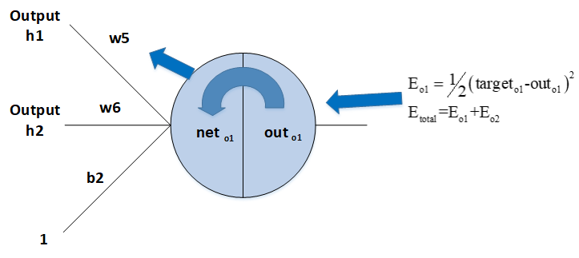

[TOC]

# 机器学习&深度学习

机器学习：利用计算机、概率论、统计学等知识，输入数据，让计算机学会新知识。机器学习的过程，就是训练数据去优化目标函数。它是**人工智能**的核心。

深度学习：深度神经网络通过学习样本数据的特征，而具备预测能力。机器学习领域中一个新的研究方向，来源于**仿生学**中的人工神经网络。



二者区别：

|          | 机器学习                                   | 深度学习                          |
| -------- | ------------------------------------------ | --------------------------------- |
| 数据量   | 小                                         | 大                                |
| 硬件配置 | 无要求                                     | 对GPU要求高                       |
| 特征提取 | 人工提取并编码                             | 神经网络提取                      |
| 解决方案 | 分解任务并单个解决                         | 端到端（类似于黑盒）              |
| 训练效率 | 长达几周                                   | 几小时                            |
| 代表     | 金融风控、Uber行程分析、用户画像、推荐系统 | AlphaGo、特斯拉自动驾驶、目标侦测 |


强化学习：强化学习是无数据、无标签，多用于决策，能够更新数据、更新模型。

> 代表：AlphaGo Zero、SpaceX火箭回收

# 感知机

感知机模型是神经元的建模，是将输入值映射到输出值的一个数学函数。有$n$个输入值，分别是$x_1, x_2, x_3 … x_n$，对应的是权重是$w_1, w_2, w_3 … w_n$，输出值为$y$。




代码实现：

```python
def perceptron(x):
    w = np.random.random(10)
    bias = 0.5
    return np.sum(w * x) + bias

x = np.random.random(10)
y = perceptron(x)
print(y)
```

# 归一化

归一化：归纳统一样本的统计分布性。归一化在$[0,1]$之间是统计的概率分布，归一化在 $[-1,1]$ 之 间是统计的坐标分布。

归一化作用：

- 数据处理方便，归一化可以避免一些不必要的数值问题。
- 统一量纲。

- 避免神经元饱和，加速收敛。（当神经元的激活接近0或1时会饱和，导致梯度消失）

- 保证输出数据中数值小的不被吞食。 


左图表示未经归一化操作的寻解过程，右图表示经过归一化后的寻解过程。

- 左图使用梯度下降法寻求最优解时，很有可能走“之字型”路线（垂直等高线走），从而导致需要迭代很多次才能收敛；
- 右图对两个原始特征进行了归一化，其对应的等高线显得很圆，在梯度下降进行求解时能较快的收敛。

因此如果机器学习模型使用梯度下降法求最优解时，归一化往往非常有必要，否则很难收敛甚至不能收敛。

#  全连接神经网络

深度神经网络，是多层感知机(MLP)结构，每一层的每一个节点都与上下层节点全部连接，这就是全连接的由来。



## 前向传播(FP)

前向传播（Forward Propagation），通过输入层输入，一路前向计算，通过输出层输出的结果。

假如有以下网络：

- 输入层包含神经元 $ i_1=0.05, i_2=0.10 $，偏置$b_1=0.35$
- 隐含层包含神经元 $ h_1, h_2 $，偏置$b_2=0.60$
- 输出层为  $ o_1, o_2 $
- $ w_i $ 为层与层之间连接的权重，初始权重 $ w1=0.15, w2=0.20, w3=0.25,w4=0.30, w5=0.40, w6=0.45, w7=0.50, w8=0.55 $
- 激活函数为 $sigmoid$ 函数。




前向传播计算过程，以$h_1$为例：

- $h_1=w_1*i_1+w_2*i_2+b_1=0.3775$
- $h_1=\frac{1}{1+e^{h_1}}=0.5933$

同理，$h_2=0.5969$

以同样的方法计算得到$[o_1,o_2]$的输出值为$[0.7514，0.7729]$，与实际值$[0.01,0.99]$相差较大

接着对误差进行**反向传播**，更新权值，重新计算输出

## 反向传播(BP)

反向传播（Back Propagation）：前向传播后得到loss，反向传播使用优化器通过学习率**更新权重**$（w、b）$，更新之后再次进行前向计算，周而复始。

优化器的目的是：**将损失降到最低**，即到达损失函数导数为0的点。如果loss使用均方差损失函数：
$$
loss=\frac{1}{n}\sum_{n}(Y-H)^2
$$
函数图像：



继续计算上面的例子：

$E_{o1}=\frac{1}{2}(target_{o1}-out_{o1})^2=0.2748$

$E_{o2}=0.0236$

$E_{total}=E_{o1}+E_{02}=0.2984$

以权重参数 $ w5 $ 为例，如果想知道 $ w5 $ 对整体误差产生了多少影响，可以用整体误差对 $ w5 $ 求偏导求出：（链式法则）
$$
\frac{\partial E_{total}}{\partial w5} = \frac{\partial E_{total}}{\partial out_{o1}} * \frac{\partial out_{o1}}{\partial net_{o1}} * \frac{\partial net_{o1}}{\partial w5}
$$
$w5$求偏导进行整合，求出偏导数之后，下面的任务就是进行梯度下降从而更新参数（$\eta$为学习率）
$$
w5=w5-\eta·\frac{\partial E_{total}}{\partial w5}
$$




##  模型实现

```python
class NetV1(nn.Module):
    def __init__(self):
        super().__init__()
        self.layer = nn.Sequential(
            # 输入层。输入特征数=图像像素数
            nn.Linear(3 * 600 * 800, 512), nn.ReLU(),
            # 隐藏层
            nn.Linear(512, 256), nn.ReLU(),
            nn.Linear(256, 128), nn.ReLU(),
            nn.Linear(128, 64), nn.ReLU(),
            nn.Linear(64, 10), nn.ReLU(),
            # 输出层。分类问题，使用softmax归一化激活输出。
            # 需要激活NV结构中的V，因此dim=1
            nn.Softmax(dim=1)
        )

    def forward(self, x):
        return self.layer(x)


if __name__ == '__main__':
    net = NetV1()
    batch_size = 256
    data = torch.randn(batch_size, 3 * 600 * 800)
    out = net.forward(data)
    print(out.shape)
```

输出结果：

```
torch.Size([256, 10])
```


> 部分参考：https://github.com/scutan90/DeepLearning-500-questions
