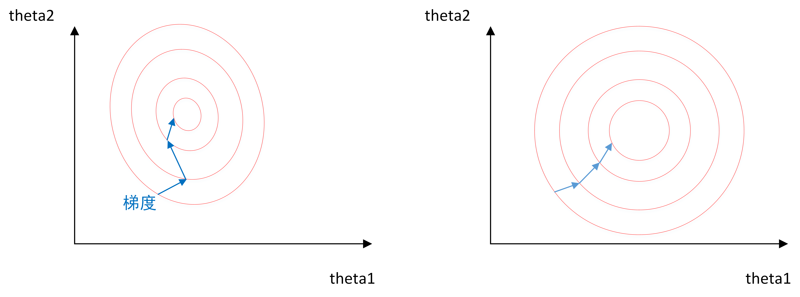

问答题

[TOC]

## 1、描述一下梯度和梯度下降的意义。

梯度：在机器学习中，我们通常定义一个损失函数，该损失函数衡量了模型预测值与真实值之间的差异。损失函数在某一点处的斜率，表示损失函数在该点处的变化率和方向。因此，梯度的方向指向了损失函数变化最快的方向，梯度的反方向指向了损失函数变化最慢的方向。

梯度下降：梯度下降是一种用于优化损失函数的迭代算法，我们需要找到使损失函数最小化的模型参数。从任意初始点开始，计算损失函数相对于这些参数的梯度，沿着梯度的反方向移动一定的步长，然后更新模型参数的值，使得损失函数不断减小，不断迭代此过程直到达到局部最小值或全局最小值。
$$
\theta = \theta - \alpha\nabla J(\theta)
$$
$\theta$为模型参数，$J(\theta)$是损失函数，$\nabla J(\theta)$表示示损失函数在当前参数点处的梯度，$\alpha$ 表示学习率，即每次迭代的步长大小。

## 2、什么是线性可分和线性不可分？线性不可分转换为线性可分有几种方法？分别是什么方法？

线性可分：当一个数据集可以被一个超平面（在二维空间中为直线，在三维空间中为平面）完全分开时，称该数据集是线性可分的。

线性不可分转换为线性可分的方法：

- 非线性特征转换：通过引入非线性特征，将原始数据从低维空间映射到高维空间，使得数据在高维空间中线性可分。
- 核方法：在算法中使用核函数来隐式地进行非线性特征转换的方法。常用的核函数包括线性核、多项式核和高斯核等。核方法可以在不显式计算高维特征的情况下，将算法应用于高维特征空间，从而实现线性不可分数据的分类。
- 聚类与分割：对于线性不可分的数据，可以先使用聚类算法将数据集分成多个类簇，然后针对每个类簇使用线性分类器。

## 3、神经网络中激活函数的意义是什么？一个激活函数需要具有哪些必要的要求？

激活函数可以引入**非线性**因素。

- 如果不使用激活函数，则输出信号仅是一个简单的线性函数，线性函数一个一级多项式，线性方程的复杂度有限，从数据中学习复杂函数映射的能力很小。
- 使用激活函数，神经网络将可以学习和模拟其他复杂类型的数据，可以用非线性来逼近任意函数。

激活函数的要素：

1. 非线性：引入激活函数，神经网络就可以基本上逼近所有的函数。
2. 可导性：激活函数在计算导数时应该是可导的，以便进行反向传播算法进行梯度计算和参数更新。
3. 非饱和性（非饱和激活函数）：饱和指的是激活函数在输入较大或较小时，导数接近于零，导致梯度消失。为了避免梯度消失的问题，激活函数应该具有较大的动态范围，即在输入较大或较小时仍能保持较大的导数值。
4. 输出范围有限：有限的输出范围使得网络对于一些比较大的输入也会比较稳定
5. 计算效率高效

## 4、sigmoid和tanh激活函数的区别是什么？sigmoid做为网络中间激活层和网络输出层的区别是什么？

sigmoid和tanh的区别：

- 输出范围：sigmoid输出区间是(0, 1)；tanh输出区间是(-1, 1)
- 中心化：sigmoid均值是0.5；tanh均值是0
- 导数范围：sigmoid导数取值范围是[0, 0.25]；tanh导数取值范围是[0, 1] (tahn一定程度上缓解了梯度消失)
- 适用范围：sigmoid在二分类问题中常用作输出层的激活函数；Tanh函数比sigmoid适用范围更广

sigmoid适合用作输出层的激活函数，可以将输出映射到(0, 1)的概率范围，表示样本属于某个类别的概率。

sigmoid如果用作隐藏层，会引入非线性。但由于均值接近于0.5，这意味着中间层的输出可能存在正向偏置或负向偏置，而且如果数据较大或较小，会导致梯度消失。

## 5、softmax输出函数和sigmoid输出函数的区别是什么？什么情况下二者可以替换？

sigmoid适用于做**二分类**，输入映射到一个(0, 1)的范围内，可以将输出解释为正类的概率。**输出不相关**：在二分类问题中，每个Sigmoid函数输出的概率独立地表示样本属于正类的概率，不会影响其他类别。

softmax适用于做**多分类**，将输入向量映射为一个概率分布，并使得所有输出的总和等于1，可以将模型的输出解释为各个类别的概率。输出相关：所有类别的概率和为1，在多类别分类问题中Softmax函数输出的概率分布是互相影响的。

如果只关心正类的概率，不需要考虑其他类别，可以使用sigmoid替代softmax；如果需要将样本分为多个可能属于的类别，并且希望模型输出的概率分布总和为1，可以使用softmax替代sigmoid

## 6、为什么softmax比sigmoid更适合做分类？

1. 概率解释：
   - Softmax函数的输出可以直接解释为每个类别的概率，可以根据概率大小判断样本属于哪个类别。
   - 而Sigmoid函数的输出只表示样本属于正类的概率，需要额外的阈值判定来确定类别。
2. 相关性：
   - Softmax函数的输出是相互关联的，这有助于模型在分类过程中考虑不同类别之间的相互关系和依赖关系。
   - 而Sigmoid函数的输出是独立的，无法捕捉类别之间的相关性。
3. 梯度计算：
   - Softmax函数在计算梯度时，涉及所有类别的概率，这使得梯度计算更加稳定和可靠。
   - 而Sigmoid函数在多标签分类问题中，由于各个Sigmoid函数是独立计算的，可能会出现梯度消失或梯度爆炸的问题。

## 7、数据归一化的方法有哪些？为什么要使用归一化？归一化和去均值化的区别是什么？

| 归一化方法                                                   | 公式                                                         | 适用范围                                           | 缺点                                                         |
| ------------------------------------------------------------ | ------------------------------------------------------------ | -------------------------------------------------- | ------------------------------------------------------------ |
| 线性归一化（Min-Max Scaling）：将数据缩放到一个指定的范围内  | $x^{\prime} = \frac{x-min(x)}{max(x) - min(x)}$              | 数值比较集中的情况                                 | 如果 max 和 min 不稳定，很容易使得归一化结果不稳定           |
| Z-Score归一化（Standardization）：将数据转换为标准正态分布，使得数据的均值为0，方差为1 | $x^{\prime} = \frac{x-\mu}{\sigma}$                          | 数据接近正态分布                                   | 偏离正态分布较远的数据，Z-Score归一化可能会产生不理想的结果  |
| 小数定标（Decimal Scaling）：数据除以一个固定的基数，如10的幂次方 | $x^{\prime} = \frac{x}{10^{j}}$                              | 数据的绝对值范围差异较大，但数据分布形状不明显偏离 | 涉及到权重的神经网络训练中，小数定标可能导致权重的值失去原始的相对大小。 |
| 向量范数归一化（Normalization）：数据向量除以其范数（如L1范数、L2范数）进行归一化 | $L_{1}=\sum_{i=1}^{n}|y_{i}-f(x_{i})|$ $L_{2}=\sum_{i=1}^{n}(y_{i}-f(x_{i}))^2$ | 任何类型数据                                       | 对异常值敏感、忽略原始数据分布、不适用于稀疏数据、不考虑特征之间的关系以及计算开销较大 |
| 非线性归一化：包括 $ log $、指数，正切等。                   |                                                              | 数据分化比较大的场景                               | 数据失真、对异常值敏感、需要参数选择和计算开销较大           |

归一化作用：

- 数据处理⽅便，归⼀化可以避免⼀些不必要的数值问题。 
- 统⼀量纲。 
- 避免神经元饱和，加速收敛。（当神经元的激活接近0或1时会饱和，导致梯度消失） 
- 保证输出数据中数值⼩的不被吞⻝。

左图表⽰未经归⼀化操作的寻解过程，右图表⽰经过归⼀化后的寻解过程。

- 左图使⽤梯度下降法寻求最优解时，很有可能⾛“之字型”路线（垂直等⾼线⾛），从⽽导致需要 迭代很多次才能收敛； 
- 右图对两个原始特征进⾏了归⼀化，其对应的等⾼线显得很圆，在梯度下降进⾏求解时能较快的收 敛。 因此如果机器学习模型使⽤梯度下降法求最优解时，归⼀化往往⾮常有必要，否则很难收敛甚⾄不能收 敛。

归一化与去均值化都是为了加速模型的收敛，不同点是：

|          | 归一化                                                       | 去均值化                                                   |
| -------- | ------------------------------------------------------------ | ---------------------------------------------------------- |
| 关注点   | 关注数据的尺度                                               | 关注数据的均值                                             |
| 算法     | 通过缩放数据将其映射到特定范围内，消除不同特征之间的尺度差异 | 通过减去均值实现数据的中心化，消除特征之间的偏移和全局偏移 |
| 原数据   | 可以改变数据的分布形状和方差，比如Z-Score归一化              | 只考虑均值信息，保持数据的分布形状和方差不变。             |
| 适用场景 | 特征之间具有不同的尺度；数据分布需要缩放到特定范围内         | 特征之间存在偏移；数据存在全局偏移；数据分布需要中心化     |

## 8、什么是归一化，它与标准化的区别是什么？

相同点：它们的相同点在于都能取消由于量纲不同引起的误差；都是一种线性变换，都是对向量X按照比例压缩再进行平移。

不同点：

- 归一化：为了将数据映射到指定的范围，用于去除不同维度数据的量纲以及量纲单位。常见的映射范围有 [0, 1] 和 [-1, 1]。

- 标准化：依照特征矩阵的列处理数据，其通过求z-score的方法，转换为标准正态分布，和整体样本分布相关，每个样本点都能对标准化产生影响。

## 9、全连接神经网络的缺点

参数量大：当输入和输出维度较大时，网络中的参数数量会快速增加，计算量和存储空间巨大，限制了网络的规模和深度

参数共享性差：每个参数独立，没有考虑数据的局部相关性，会导致参数冗余。（卷积神经网络会使用权值共享解决该问题）

过拟合问题：全连接神经网络的参数量大，网络模型很容易过拟合训练数据。

丢失空间信息：输入数据的位置信息并未得到明确的保留，对于一些图像、语言等任务无法学习到这些信息。

## 10、画图表示什么是反向传播？

## 11、反向传播是如何进行梯度更新的？

### 正向传播

正向传播计算得到$o_1,o_2$的输出值，与实际值$label_{1},label_{2}$比较

### 反向传播，更新权值，重新计算输出

以下计算输出层到隐藏层的更新

loss使用均方差损失函数：$loss=\frac{1}{n}\sum_{n}(Y-H)^2$

$$
E_{o1}=\frac{1}{2}(target_{o1}-out_{o1})^2\\
E_{o2}=\frac{1}{2}(target_{o2}-out_{o2})^2\\
E_{total}=E_{o1}+E_{02}\\
$$

以权重参数 $ w5 $ 为例，如果想知道 $ w5 $ 对整体误差产生了多少影响，可以用整体误差对 $ w5 $ 求偏导求出：（链式法则）
$$
\frac{\partial E_{total}}{\partial w5} = \frac{\partial E_{total}}{\partial out_{o1}} * \frac{\partial out_{o1}}{\partial net_{o1}} * \frac{\partial net_{o1}}{\partial w5}
$$

分别计算：
$E_{total}=E_{o1}+E_{02} =\frac{1}{2}(target_{o1}-out_{o1})^2 +\frac{1}{2}(target_{o2}-out_{o2})^2$
$\frac{\partial E_{total}}{\partial out_{o1}} = -(target_{o1}-out_{o1})\\$

$out_{o1}=\frac{1}{1+e^{-net_{o1}}}$

$\frac{\partial out_{o1}}{\partial net_{o1}} = out_{o1}(1-out{o1})$

(实际是sigmoid求导)

$net_{o1}=w_{5} ·out_{h1}+w_{6}·out_{h2}+b_{2} $

$\frac{\partial net_{o1}}{\partial w5} = 1*out_{h1}*w_{5}^(1-1)+0+0$

三者相乘可得出$\frac{\partial E_{total}}{\partial w5}$的值，最后结合学习率$\eta$更新$w_{5}$值：
$$
w_{5}=w_{5}-\eta·\frac{\partial E_{total}}{\partial w_{5}}
$$
同理可更新$w_{6}，w_{7}，w_{8}$的值

### 隐藏层的更新：

以$w_{1}$为例子：

$$
\frac{\partial E_{total}}{\partial w1} = \frac{\partial E_{total}}{\partial out_{h1}} * \frac{\partial out_{h1}}{\partial net_{h1}} * \frac{\partial net_{h1}}{\partial w1}\\

\frac{\partial E_{total}}{\partial w1} = (\frac{\partial E_{o1}}{\partial out_{h1}}+\frac{\partial E_{o2}}{\partial out_{h1}}) * \frac{\partial out_{h1}}{\partial net_{h1}} * \frac{\partial net_{h1}}{\partial w1}
$$

需要注意：$out_{h1}$会接受$E_{o1}$和$E_{o2}$两个地方传来的误差

$\frac{\partial E_{o1}}{\partial out_{h1}} = \frac{\partial E_{o1}}{\partial net_{o1}}*\frac{\partial net_{o1}}{\partial out_{h1}}  =(\frac{\partial E_{o1}}{\partial out_{o1}}*\frac{\partial out_{o1}}{\partial net_{o1}})*w_{5}\\$
$\frac{\partial E_{o2}}{\partial out_{h1}} $同理

$out_{h1}=\frac{1}{1+e^{-net_{h1}}}$

$\frac{\partial out_{h1}}{\partial net_{h1}} = out_{h1}(1-out{h1})$

$net_{h1}=w_{1} ·x_{1}+w_{2}·x_{2}+b $

$\frac{\partial net_{h1}}{\partial w1} = x_{1}$

三者相乘可得$\frac{\partial E_{total}}{\partial w1} $, 更新$w_{1}$
$$
w_{1}=w_{1}-\eta·\frac{\partial E_{total}}{\partial w_{1}}
$$
同理可更新$w_{2}，w_{3}，w_{4}$的值

以上即为反向传播的完整过程

> 反向传播部分参考博客https://www.cnblogs.com/charlotte77/p/5629865.html