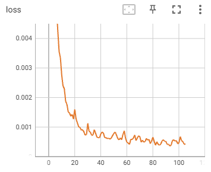
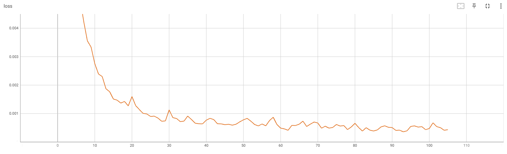
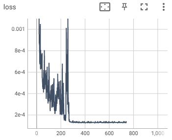
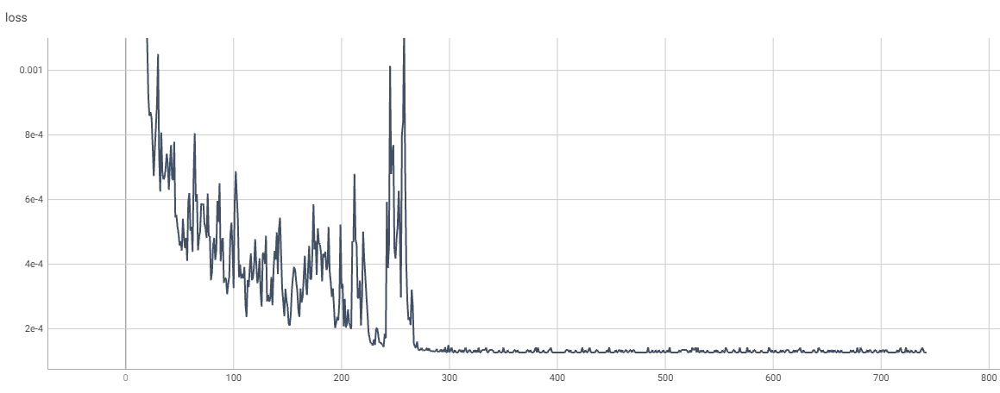
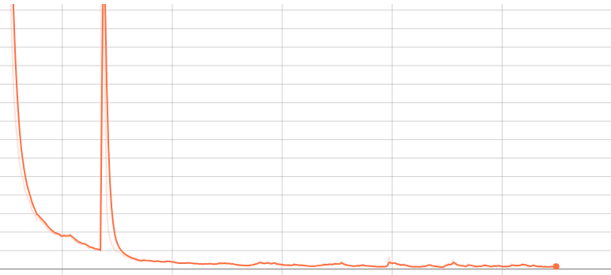

# MNIST数据集训练

## 全连接7层-100轮：得分97.8

网络代码：

```python
import torch.nn as nn


class FcNet1(nn.Module):
    def __init__(self):
        super().__init__()
        self.in_layer = nn.Sequential(
            nn.Linear(1 * 28 * 28, 512), nn.ReLU()
        )
        self.hidden_layer = nn.Sequential(
            nn.Linear(512, 512), nn.ReLU(),
            nn.Linear(512, 256), nn.ReLU(),
            nn.Linear(256, 256), nn.ReLU(),
            nn.Linear(256, 128), nn.ReLU(),
            nn.Linear(128, 64), nn.ReLU(),
        )
        self.out_layer = nn.Sequential(
            nn.Linear(64, 10), nn.Softmax(dim=1)
        )

    def forward(self, x):
        x = self.in_layer(x)
        x = self.hidden_layer(x)
        x = self.out_layer(x)
        return x
```

训练100轮次

```
Train Epoch: 91,  Loss: 0.0004083049716427922
Train Epoch: 92,  Loss: 0.0004167816659901291
Train Epoch: 93,  Loss: 0.0003582205972634256
Train Epoch: 94,  Loss: 0.00039241433842107654
Train Epoch: 95,  Loss: 0.000547252653632313
Train Epoch: 96,  Loss: 0.0005667962832376361
Train Epoch: 97,  Loss: 0.0005247733206488192
Train Epoch: 98,  Loss: 0.0005393305909819901
Train Epoch: 99,  Loss: 0.0004330728843342513
Train Epoch: 100,  Loss: 0.00047447223914787173
Train Epoch: 101,  Loss: 0.0006749320309609175
Train Epoch: 102,  Loss: 0.0005407241405919194
Train Epoch: 103,  Loss: 0.0005029648309573531
Train Epoch: 104,  Loss: 0.00041269921348430216
Train Epoch: 105,  Loss: 0.00043362786527723074
```


$Loss$图像:





最终测试得分：

```
Test Epoch: 0,  Score: 0.9786750614643097
Test Epoch: 1,  Score: 0.9785853803157807
Test Epoch: 2,  Score: 0.9784657955169678
Test Epoch: 3,  Score: 0.9786152720451355
Test Epoch: 4,  Score: 0.9784359037876129
Test Epoch: 5,  Score: 0.9786152720451355
```

结论：训练轮次不够

## 全连接7层-750轮（lr=0.002）得分：98.3

全连接7层-750轮（lr=0.002）





测试结果：

```
Test Score: 0.9833860759493671
Test Score: 0.9833860759493671
Test Score: 0.9833860759493671
Test Score: 0.9833860759493671
Test Score: 0.982693829113924
Test Score: 0.9833860759493671
```

结论：损失在280轮左右收敛，最终得分98.3

## 全连接10层，得分：98.0

```python
class FcNet2(nn.Module):
    def __init__(self):
        super().__init__()
        self.in_layer = nn.Sequential(
            nn.Linear(1 * 28 * 28, 512), nn.ReLU()
        )
        self.hidden_layer = nn.Sequential(
            nn.Linear(512, 512), nn.ReLU(),
            nn.Linear(512, 256), nn.ReLU(),
            nn.Linear(256, 256), nn.ReLU(),
            nn.Linear(256, 128), nn.ReLU(),
            nn.Linear(128, 128), nn.ReLU(),
            nn.Linear(128, 64), nn.ReLU(),
            nn.Linear(64, 64), nn.ReLU(),
            nn.Linear(64, 32), nn.ReLU(),
        )
        self.out_layer = nn.Sequential(
            nn.Linear(32, 10), nn.Softmax(dim=1)
        )

    def forward(self, x):
        x = self.in_layer(x)
        x = self.hidden_layer(x)
        x = self.out_layer(x)
        return x

```

```
Train Epoch: 341,  Loss: 0.0002396852505626157
Train Epoch: 342,  Loss: 0.0002610397059470415
Train Epoch: 343,  Loss: 0.00029076513601467013
Train Epoch: 344,  Loss: 0.00025216187350451946
Train Epoch: 345,  Loss: 0.0002579962310846895
Train Epoch: 346,  Loss: 0.0003019840514753014
```



得分：

```
Test Score: 0.9806170886075949
Test Score: 0.9806170886075949
```

## 完整代码

`fc.net.py`

```python
import torch.nn as nn


class FcNet1(nn.Module):
    def __init__(self):
        super().__init__()
        self.in_layer = nn.Sequential(
            nn.Linear(1 * 28 * 28, 512), nn.ReLU()
        )
        self.hidden_layer = nn.Sequential(
            nn.Linear(512, 512), nn.ReLU(),
            nn.Linear(512, 256), nn.ReLU(),
            nn.Linear(256, 256), nn.ReLU(),
            nn.Linear(256, 128), nn.ReLU(),
            nn.Linear(128, 64), nn.ReLU(),
        )
        self.out_layer = nn.Sequential(
            nn.Linear(64, 10), nn.Softmax(dim=1)
        )

    def forward(self, x):
        x = self.in_layer(x)
        x = self.hidden_layer(x)
        x = self.out_layer(x)
        return x

```

`mnist_demo.py`

```python
import os

import cv2
import numpy as np
import torch.cuda
from skimage import io
from torch.utils.data import Dataset, DataLoader
from torch.utils.tensorboard import SummaryWriter
from torchvision import datasets, transforms
from torchvision.datasets import mnist

from models import fc_net


def mnist_to_img():
    # 数据集存放根路径
    root = r'E:\data'
    # 下载数据
    train_dataset = datasets.MNIST(root=root, train=True, transform=transforms.ToTensor(), download=True)
    test_dataset = datasets.MNIST(root=root, train=False, transform=transforms.ToTensor(), download=True)

    img_train = os.path.join(root, 'MNIST', 'raw', 'train-images-idx3-ubyte')
    img_test = os.path.join(root, 'MNIST', 'raw', 't10k-images-idx3-ubyte')
    label_train = os.path.join(root, 'MNIST', 'raw', 'train-labels-idx1-ubyte')
    label_test = os.path.join(root, 'MNIST', 'raw', 't10k-labels-idx1-ubyte')

    # 读取二进制数据
    train_set = mnist.read_image_file(img_train), mnist.read_label_file(label_train)
    test_set = mnist.read_image_file(img_test), mnist.read_label_file(label_test)

    # 向train或test写入图片
    root = r'E:\data\MNIST\raw'

    def save_img(dataset, is_train):
        for idx, (img, label) in enumerate(zip(dataset[0], dataset[1])):
            # 要存储的图片的目录路径  root + train/test + label
            img_dir_path = os.path.join(root, 'train' if is_train else 'test', str(label.item()))
            # 图片全路径
            img_path = os.path.join(img_dir_path, f'{idx}.jpg')
            if not os.path.exists(img_dir_path):
                os.makedirs(img_dir_path)
            # 写入图片
            io.imsave(img_path, np.array(img))

    save_img(train_set, True)
    save_img(test_set, False)


class MNIST_Dataset(Dataset):
    def __init__(self, root=r'E:\data\MNIST\raw', isTrain=True):
        super().__init__()
        self.dataset = []
        # 读文件
        path = os.path.join(root, 'train' if isTrain else 'test')
        for label in os.listdir(path):
            for img_name in os.listdir(os.path.join(path, label)):
                img_path = os.path.join(path, label, img_name)
                self.dataset.append((img_path, label))

    def __len__(self):
        return len(self.dataset)

    def __getitem__(self, idx):

        data = self.dataset[idx]
        img = cv2.imread(data[0], 0)
        # 由于全连接是NV结构，需要对数据降维
        img = img.reshape(-1)
        # 归一化数据
        img = img / 255
        # 标签进行one-hot
        ont_hot = np.zeros(10)
        ont_hot[int(data[1])] = 1
        return np.float32(img), np.float32(ont_hot)


class Trainer:
    def __init__(self):
        # 定义数据集
        train_dataset = MNIST_Dataset()
        test_dataset = MNIST_Dataset(isTrain=False)
        # 定义数据加载器
        self.train_loader = DataLoader(dataset=train_dataset, batch_size=1024, shuffle=True)
        self.test_loader = DataLoader(dataset=train_dataset, batch_size=1024, shuffle=True)

        # 当前设备环境
        self.device = 'cuda' if torch.cuda.is_available() else 'cpu'
        # 定义网络
        self.net = fc_net.FcNet1()
        self.net.to(self.device)

        # 定义优化器
        self.optim = torch.optim.Adam(self.net.parameters(), lr=0.001)

    def train(self):
        writer = SummaryWriter('./result', r'E:\pyprojects\zhenshu_caokj\result')
        for epoch in range(1, 10000):
            sum_loss = 0.
            for i, (img, label) in enumerate(self.train_loader):
                # 网络开启训练模式
                self.net.train()
                # 数据放到device
                img, label = img.to(self.device), label.to(self.device)

                # 前向计算
                y = self.net(img)

                # 计算损失
                loss = torch.mean((label - y) ** 2)

                # 清空过往梯度
                self.optim.zero_grad()
                # 反向传播 计算梯度，并将梯度值存储在每个参数的 grad属性中。
                loss.backward()
                # 更新模型参数：优化器根据梯度值和指定的学习率更新模型的参数值
                self.optim.step()
                # 写入权重文件
                torch.save(self.net.state_dict(), f'params2//{i}.pt')

                sum_loss += loss

            avg_loss = sum_loss / len(self.train_loader)
            print(f'Epoch: {epoch},  Loss: {avg_loss}')

            # 使用TensorBoard图形化显示
            # 命令行启动board：tensorboard --logdir=result --port=8899
            writer.add_scalar('loss', avg_loss, epoch)

    def test(self):
        # 把最优的训练效果进行测试
        self.net.load_state_dict(torch.load(r'params2//' + os.listdir(r'params2')[-1]))
        for epoch in range(100):
            sum_score = 0
            for i, (img, label) in enumerate(self.test_loader):
                # 测试模式
                self.net.eval()
                img, label = img.to(self.device), label.to(self.device)

                h = self.net(img)

                # h为网络计算答案,label标准答案
                a = torch.argmax(h, dim=1)
                b = torch.argmax(label, dim=1)
                # 当前批次得分
                score = torch.mean(torch.eq(a, b).float())
                sum_score += score
            avg_score = sum_score / len(self.test_loader)
            print(f'第{epoch}轮的得分是{avg_score}')
        pass


if __name__ == '__main__':
    # 数据预处理
    # mnist_to_img()
    # 实例化训练器
    trainer = Trainer()
    trainer.train()
    # trainer.test()
```

