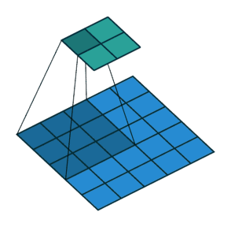

[TOC]

> 全连接神经网络的缺点
>
> - 处理大尺寸图像，将图像(CHW)压缩为向量(V)会丢失空间信息
> - 权重过多，训练效率低，网络容易过拟合。


# 卷积

卷积所表达的运算其实是*互相关运算*（cross-correlation）。

卷积运算：数据和滤波器的区域做**点积（对位相乘求和）**。从一个小小的权重矩阵【**卷积核（kernel）**】开始，让它逐步在二维输入数据上“扫描”。卷积核“滑动”的同时，计算权重矩阵和扫描所得的数据矩阵的乘积，然后把结果汇总成一个输出像素。


卷积的优点：

- 减少网络参数量。
- **权值共享，池化层，感受野**，缓解过拟合问题。多维数据（图像，语音）可直接输入网络

## 感受野

特征图(feature map)上的像素点映射回**原图像**上的区域大小。感受野的值可以用来大致判断每一层的抽象层次

上图，conv1感受野是3，conv2中感受野大小是5

神经元感受野的值越大表示其能接触到的原始图像范围就越大，也意味着它可能蕴含更为全局，语义层次更高的特征；相反，值越小则表示其所包含的特征越趋向局部和细节。

https://zhuanlan.zhihu.com/p/296621824

## 多通道卷积：


如果输出通道是3通道


**输入数据的通道数 = 卷积核通道数**
**输出数据的通道数 = 卷积核个数**

## 步长和填充

将每次滑动的行数和列数称为Stride，在下图中，Stride=2。



卷积运算会下采样，在图片的外围进行填充，可以避免卷积运算之后的图片尺寸变小。


*padding_mode*:

```
tensor([[[[ 1.,  2.,  3.,  4.],
          [ 5.,  6.,  7.,  8.],
          [ 9., 10., 11., 12.],
          [13., 14., 15., 16.]]]], requires_grad=True)
```

- zeros：零填充（默认）

```
tensor([[[[ 0.,  0.,  0.,  0.,  0.,  0.],
          [ 0.,  1.,  2.,  3.,  4.,  0.],
          [ 0.,  5.,  6.,  7.,  8.,  0.],
          [ 0.,  9., 10., 11., 12.,  0.],
          [ 0., 13., 14., 15., 16.,  0.],
          [ 0.,  0.,  0.,  0.,  0.,  0.]]]], grad_fn=<ThnnConv2DBackward>)
```

- reflect：对称填充

```
tensor([[[[ 6.,  5.,  6.,  7.,  8.,  7.],
          [ 2.,  1.,  2.,  3.,  4.,  3.],
          [ 6.,  5.,  6.,  7.,  8.,  7.],
          [10.,  9., 10., 11., 12., 11.],
          [14., 13., 14., 15., 16., 15.],
          [10.,  9., 10., 11., 12., 11.]]]], grad_fn=<ThnnConv2DBackward>)
```

- replicate：边缘复制

```
tensor([[[[ 1.,  1.,  2.,  3.,  4.,  4.],
          [ 1.,  1.,  2.,  3.,  4.,  4.],
          [ 5.,  5.,  6.,  7.,  8.,  8.],
          [ 9.,  9., 10., 11., 12., 12.],
          [13., 13., 14., 15., 16., 16.],
          [13., 13., 14., 15., 16., 16.]]]], grad_fn=<ThnnConv2DBackward>)
```

- circular：循环的进行填充

```
tensor([[[[16., 13., 14., 15., 16., 13.],
          [ 4.,  1.,  2.,  3.,  4.,  1.],
          [ 8.,  5.,  6.,  7.,  8.,  5.],
          [12.,  9., 10., 11., 12.,  9.],
          [16., 13., 14., 15., 16., 13.],
          [ 4.,  1.,  2.,  3.,  4.,  1.]]]], grad_fn=<ThnnConv2DBackward>)
```

## 计算公式

$$
o=\left \lfloor \frac{n+2p-f} {s} \right \rfloor +1
$$

$n$为输入图片尺寸，$f$为卷积核大小，$p$为填充大小，$s$为步长大小

## 空洞卷积


作用：

- 扩大感受野

- 捕获多尺度上下文信息

# 总结

参考:https://zhuanlan.zhihu.com/p/77471866