[TOC]

# 1.图像特征

| 特征                          | 含义                                                         | 检测算法                                                     |
| ----------------------------- | ------------------------------------------------------------ | ------------------------------------------------------------ |
| 角点（Corner）                | 图像中具有明显变化的位置，通常是图像中两个或多个边缘相交的地方。具有旋转不变性和光照不变性和视角不变性 | Harris角点检测、Shi-Tomasi角点检测、FAST角点检测、ORB角点检测等 |
| 边缘（Edges）                 | 图像中明显的亮度变化区域，标识物体边界的线段。               | 如Canny边缘检测                                              |
| 区域（Blob）                  | 图像中具有相对均一的局部区域，与周围区域有明显的对比度差异。 | 检测算法如Laplacian of Gaussian（LoG）和Difference of Gaussian（DoG） |
| 颜色特征                      | 描述图像中的颜色分布和色彩信息。                             | 包括颜色直方图、颜色矩和颜色梯度等。                         |
| 轮廓曲度（Contour curvature） | 在曲线上某一点的曲率大小，用于描述曲线在该点的弯曲程度。轮廓曲率反映了曲线在该点的局部形状特征。 | 常用的计算曲线曲率的方法包括数值法和微分几何法               |
| 纹理特征（Texture）           | 纹理是图像中重复或规律的局部结构，描述了物体的细节特征。     | 常用的纹理特征包括灰度共生矩阵（GLCM）、局部二值模式（LBP）、方向梯度直方图（HOG）等。 |
| 形状特征                      | 表示物体的整体形状，也可以用于描述物体的局部形状。           |                                                              |
| 空间关系特征                  | 图像分割中的多个目标之间的相互的空间位置或相对方向关系。可以分为两类：相对/绝对空间位置信息。 | 一种是首先对图像进行分割，划分出区域，然后根据这些区域提取图像特征；另一种方法将图像均匀地划分为子块，然后对每个子块提取特征 |


# 2.扩散模型

## 2.1 概念

机器学习中，扩散模型或扩散概率模型是一类潜变量模型，是用变分估计训练的**马尔可夫链**。扩散模型的目标是通过对数据点在**潜空间**（latent sapce）中的扩散方式进行建模，来学习数据集的潜结构。计算机视觉中，这意味着通过学习逆扩散过程训练神经网络，使其能对叠加了高斯噪声的图像进行去噪。应用：图像去噪、图像修复、超分辨率成像、图像生成等等【摘自[wiki百科-扩散模型](https://zh.wikipedia.org/wiki/%E6%89%A9%E6%95%A3%E6%A8%A1%E5%9E%8B)】

>马尔可夫链：[状态空间](https://zh.wikipedia.org/wiki/狀態空間_(計算機科學))中经过从一个状态到另一个状态的转换的[随机过程](https://zh.wikipedia.org/wiki/随机过程)。该过程要求具备“无记忆”的性质：下一状态的概率分布只能由当前状态决定，在时间序列中它前面的事件均与之无关。
>
>隐空间（latent sapce）：为了找到 模式(pattern)  而学习数据特征并且简化数据表示。

扩散模型是在2015年提出的，其动机来自非平衡态热力学

图像生成领域最常见生成模型有： GAN(生成对抗网络)和VAE(变分自编码器)

2020年，DDPM（Denoising Diffusion Probabilistic Model） 被提出，被称为扩散模型（Diffusion Model），同样可用于图像生成。【[DDPM论文地址](https://arxiv.org/abs/2006.11239)】

2022年底，Stability AI发布文本生成图像模型 Stable Diffusion 的最新版本，其生成的图像达到商用级别。


## 2.2 DDPM理解

简单来说，扩散模型包含两个过程：**前向扩散过程**和**反向生成过程**，前向扩散过程是对一张图像逐渐添加高斯噪音直至变成**随机噪音**，而反向生成过程是**去噪音过程**，我们将从一个随机噪音开始逐渐去噪音直至生成一张图像，这也是我们要求解或者训练的部分。

### 2.2.1 前向过程（扩散过程）

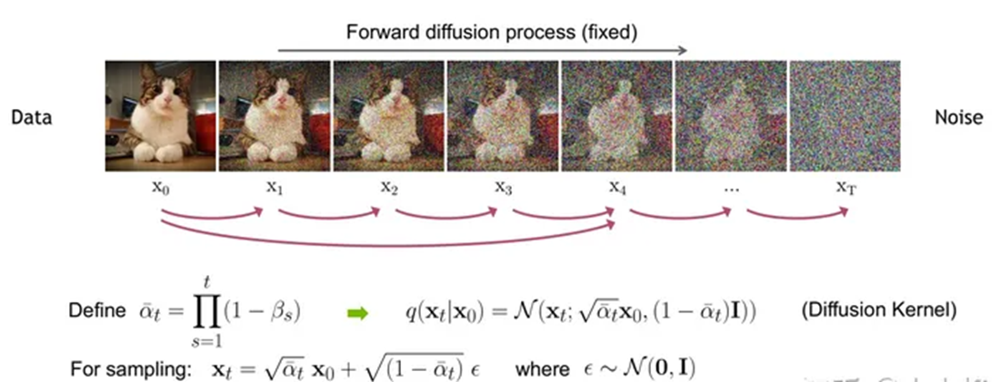


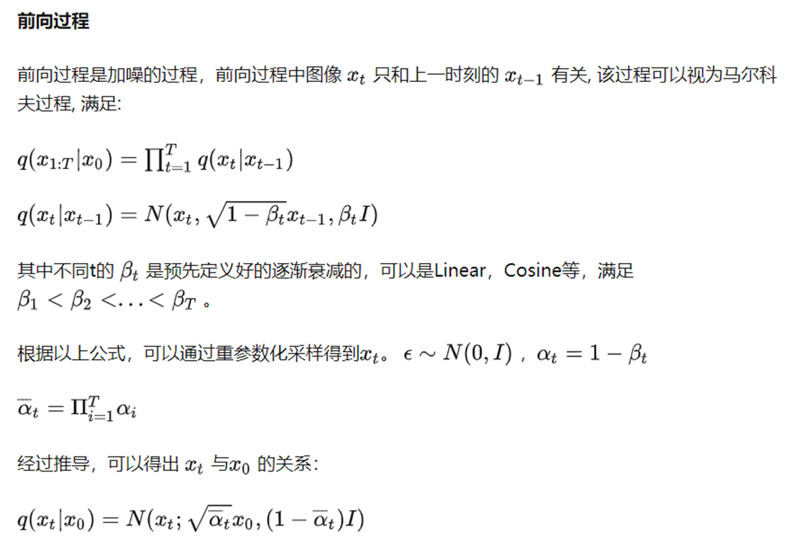

###  2.2.2 逆向过程

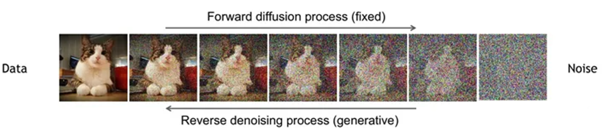


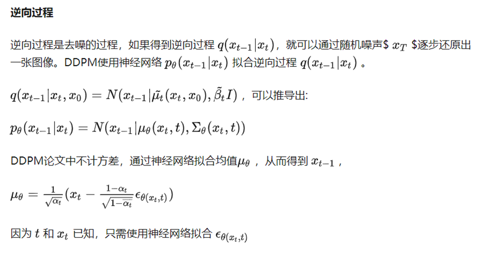

### 2.2.3 模型设计-Unet

扩散模型的核心就在于训练噪音预测模型。DDPM所采用的模型是一个基于residual block和attention block的**U-Net模型**。

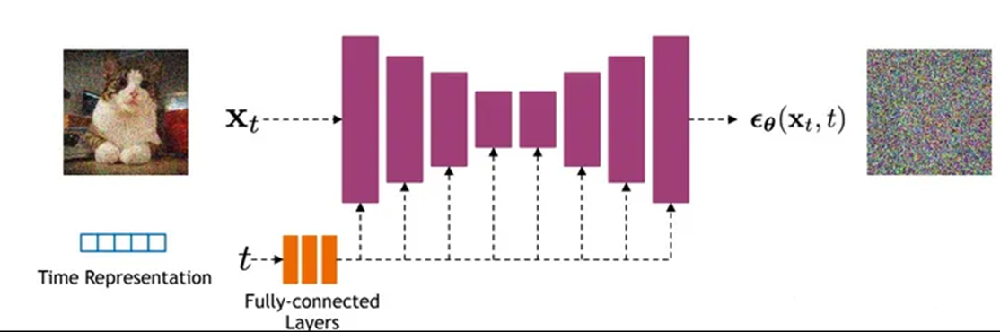


U-Net属于encoder-decoder架构，其中encoder分成不同的stages，每个stage都包含下采样模块来降低特征的空间大小（H和W），然后decoder和encoder相反，是将encoder压缩的特征逐渐恢复。U-Net在decoder模块中还引入了**skip connection**，即concat了encoder中间得到的同维度特征，这有利于网络优化。DDPM所采用的U-Net每个stage包含**2个residual block**，而且部分stage还加入了**self-attention模块**增加网络的全局建模能力。 另外，扩散模型其实需要的是$T$个噪音预测模型，实际处理时，可以增加一个**time embedding**（类似transformer中的position embedding）来将timestep编码到网络中，从而只需要训练一个共享的U-Net模型。

> 参考https://www.zhihu.com/question/545764550

## 2.3 stable diffusion框架

如下图：

①②为训练部分：

- 使用 AutoEncoderKL 自编码器将图像 Image 从 pixel space 映射到 latent space，学习图像的隐式表达
- 使用 FrozenCLIPEmbedder 文本编码器对 Prompt 提示词进行编码，生成embedding 表示
- 对图像的隐式表达进行不断加噪进行前向扩散过程（Diffusion Process），之后对加噪后的图像调用 UNetModel 对噪声进行预估；UNetModel 同时接收图像的隐式表达 latent image 以及文本 embedding context，在训练时以 context 作为 condition，使用 Attention 机制来更好的学习文本与图像的匹配关系
- 扩散模型输出噪声$\epsilon _{\theta}$，计算和真实噪声之间的误差作为 Loss，通过反向传播算法更新 UNetModel 模型的参数，注意这个过程中 AutoEncoderKL 和 FrozenCLIPEmbedder 中的参数不会被更新。

②③是生成部分：

- 使用 FrozenCLIPEmbedder 文本编码器对 Prompt 提示词进行编码，生成embedding 表示
- 随机产出的噪声 Noise，利用训练好的 UNetModel 模型，按照 DDPM/DDIM/PLMS 等算法迭代 T 次，将噪声不断去除，恢复出图像的 latent 表示；
- 使用 AutoEncoderKL 对图像的 latent 表示进行 decode（解码），最终恢复出 pixel space 的图像

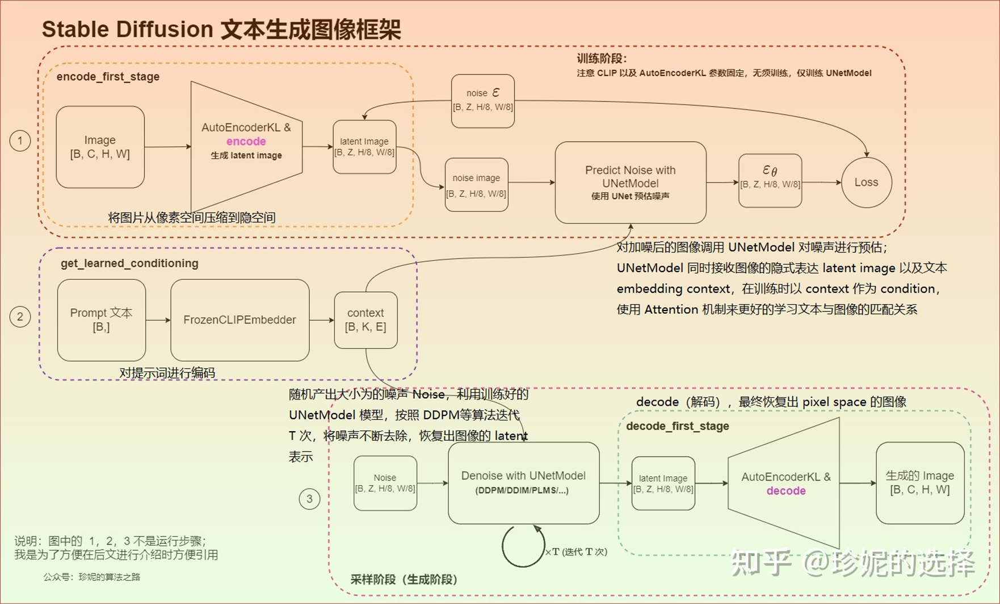

> 参考https://zhuanlan.zhihu.com/p/613337342

# 3.经典网络resnet18和resnet101

resnet18、resnet101训练cifar10（对比：效率、精度、资源占用）

训练loss与score对比（紫色为resnet18，橙色为resnet101）：

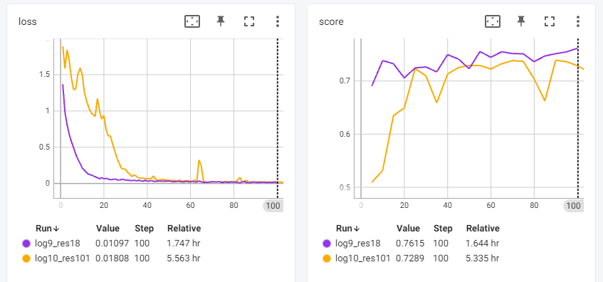


|              | resnet18                                                     | resnet101                                                    |
| ------------ | ------------------------------------------------------------ | ------------------------------------------------------------ |
| 资源占用     | 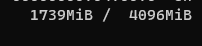 | 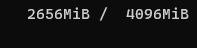 |
| 100轮总用时  | 1.747 h                                                      | 5.563 h                                                      |
| 平均每轮用时 | 62.9 s                                                       | 200.2 s                                                      |


# 4.残差网络和信息瓶颈

## 4.1 提出背景

传统的深度神经网络存在梯度消失和梯度爆炸等问题，导致网络深度增加时难以训练。

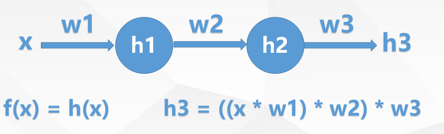

反向传播的时候，对参数链式求导，导数连乘中，如果有一个参数接近0，则梯度消失。网络越深，梯度消失的可能性越大。


残差网络（ResNet）：通过引入残差块（residual block）来解决梯度消失和梯度爆炸等问题。残差块包含了跳跃连接，即将输入直接添加到残差块的输出，形成残差连接。这样，网络可以通过直接学习残差来适应更复杂的映射关系，而不仅仅是学习原始的映射。

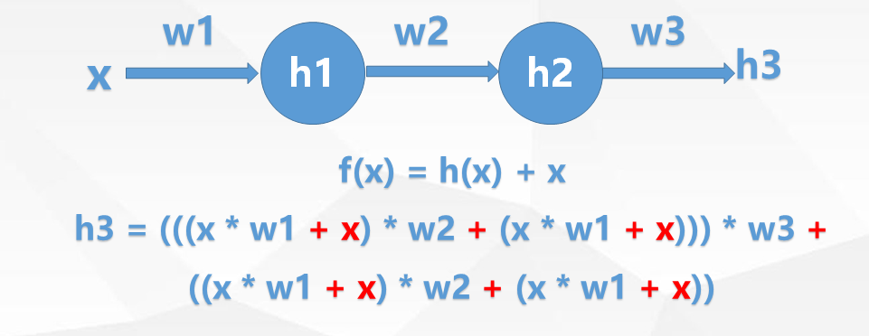

关键思想：**网络可以跨层直接传递信息**

## 4.2 残差块(Residual block)

残差块因为在$forward()$函数的最后需要将输入$x$和学习到的残差$F(x)$相加，所以这两个张量的尺寸应该是完全一致的

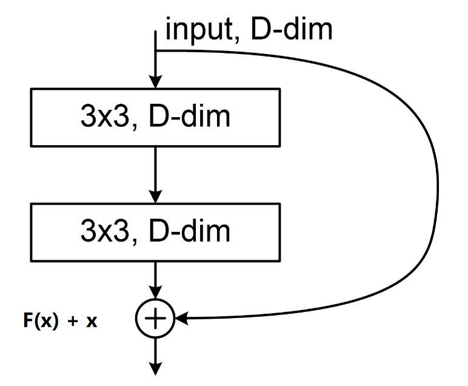

代码实现：

```python
from torch import nn


# CHW不变
class ResidualBlock(nn.Module):
    def __init__(self, c):
        super().__init__()
        self.conv1 = nn.Conv2d(in_channels=c, out_channels=c, kernel_size=3, stride=1, padding=1)
        self.relu = nn.ReLU()
        self.conv2 = nn.Conv2d(in_channels=c, out_channels=c, kernel_size=3, stride=1, padding=1)

    def forward(self, x):
        out = self.conv1(x)
        out = self.relu(out)
        out = self.conv2(out)
        return self.relu(out + x)


class ResNetV1(nn.Module):
    def __init__(self):
        super().__init__()
        self.conv1 = nn.Conv2d(in_channels=3, out_channels=32, kernel_size=3, stride=1)
        self.relu1 = nn.ReLU()
        self.resnet_block1 = ResidualBlock(32)
        self.conv2 = nn.Conv2d(in_channels=32, out_channels=64, kernel_size=3, stride=1)
        self.relu2 = nn.ReLU()
        self.resnet_block2 = ResidualBlock(64)
        self.conv3 = nn.Conv2d(in_channels=64, out_channels=128, kernel_size=3, stride=1)

    def forward(self, x):
        out = self.relu1(self.conv1(x))
        out = self.resnet_blcok1(out)
        out = self.relu2(self.conv2(out))
        out = self.resnet_blcok2(out)
        out = self.conv3(out)
        return out
```

## 4.3 瓶颈块(Bottleneck block)

在ResNet中，瓶颈结构用于减少网络中的参数数量和计算量，同时提高网络的表示能力。1x1的卷积层起到了降维整合信息和升维的作用，3x3的卷积层用于学习特征。

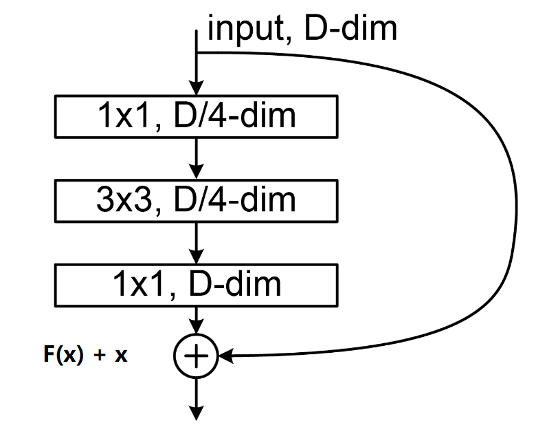

代码实现：

```python
import torch.nn.functional as F
from torch import nn


# 信息瓶颈：核心是操作通道
class BottleneckBlock(nn.Module):
    def __init__(self, c):
        super().__init__()
        self.conv1 = nn.Conv2d(in_channels=c, out_channels=c // 4, kernel_size=1)
        self.conv2 = nn.Conv2d(in_channels=c // 4, out_channels=c // 4, kernel_size=3, padding=1)
        self.conv3 = nn.Conv2d(in_channels=c // 4, out_channels=c, kernel_size=1)

    def forward(self, x):
        out = F.relu(self.conv1(x))
        out = F.relu(self.conv2(out))
        out = F.relu(self.conv3(out))
        return F.relu(out + x)


class ResNetV2(nn.Module):
    def __init__(self):
        super().__init__()
        self.conv1 = nn.Conv2d(in_channels=3, out_channels=32, kernel_size=3, stride=1)
        self.relu1 = nn.ReLU()
        self.bottleneck_block1 = BottleneckBlock(32)
        self.conv2 = nn.Conv2d(in_channels=32, out_channels=64, kernel_size=3, stride=1)
        self.relu2 = nn.ReLU()
        self.bottleneck_block2 = BottleneckBlock(64)
        self.conv3 = nn.Conv2d(in_channels=64, out_channels=128, kernel_size=3, stride=1)

    def forward(self, x):
        out = self.relu1(self.conv1(x))
        out = self.bottleneck_block1(out)
        out = self.relu2(self.conv2(out))
        out = self.bottleneck_block2(out)
        out = self.conv3(out)
        return out
```

