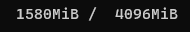
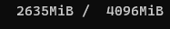
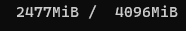
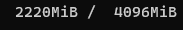
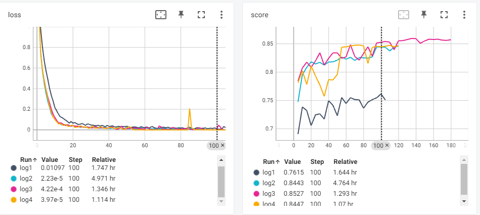
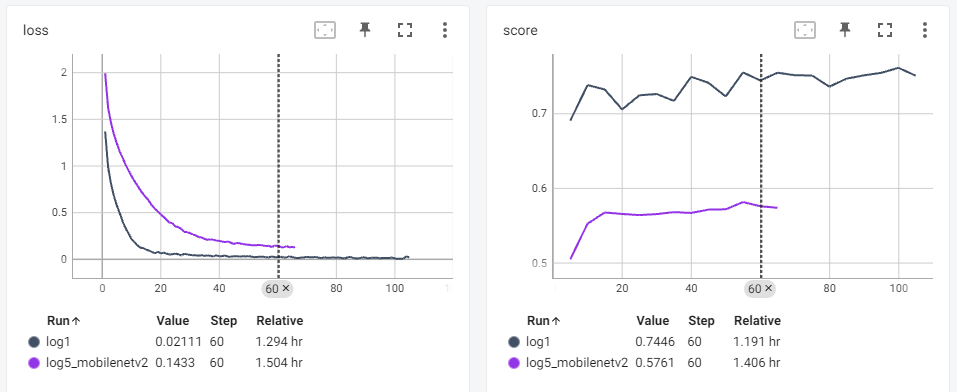
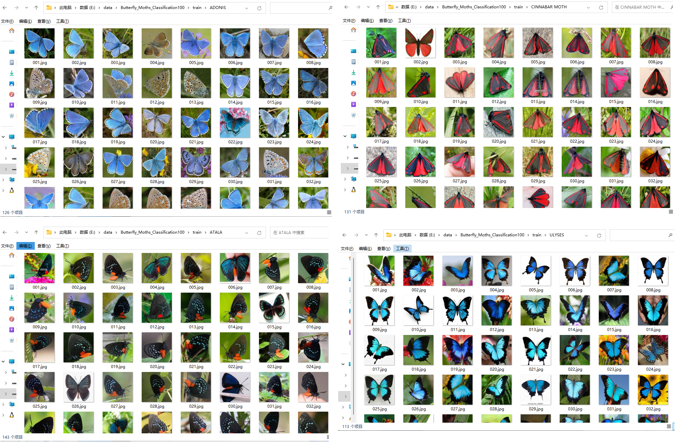
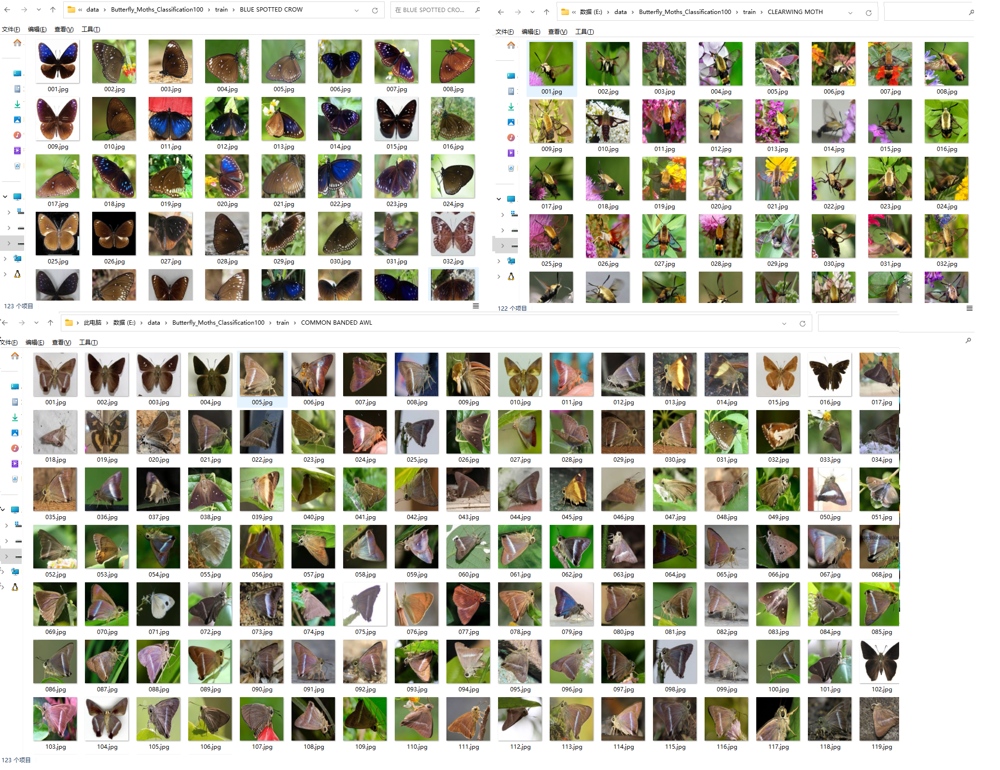

[TOC]

# resnet18复现与优化

resnet18复现：

```python
import torch
import torch.nn as nn


# 定义基本的ResNet块
class BasicBlock(nn.Module):
    def __init__(self, in_channels, out_channels):
        super(BasicBlock, self).__init__()
        stride = 1 if in_channels == out_channels else 2

        self.conv1 = nn.Conv2d(in_channels, out_channels, kernel_size=3, stride=stride, padding=1, bias=False)
        self.bn1 = nn.BatchNorm2d(out_channels)
        self.relu = nn.ReLU(inplace=True)
        self.conv2 = nn.Conv2d(out_channels, out_channels, kernel_size=3, stride=1, padding=1, bias=False)
        self.bn2 = nn.BatchNorm2d(out_channels)

        self.shortcut = nn.Sequential()
        # 如果输入输出通道不相等，表示需要 经shortcut结构使输入x与输出形状相匹配
        if in_channels != out_channels:
            self.shortcut = nn.Sequential(
                nn.Conv2d(in_channels, out_channels, kernel_size=1, stride=stride, bias=False),
                nn.BatchNorm2d(out_channels)
            )

    def forward(self, x):
        out = self.conv1(x)
        out = self.bn1(out)
        out = self.relu(out)

        out = self.conv2(out)
        out = self.bn2(out)

        out += self.shortcut(x)
        return self.relu(out)


# 定义ResNet模型
class ResNet(nn.Module):
    def __init__(self, classes_num=1000):
        super(ResNet, self).__init__()

        self.conv1 = nn.Conv2d(3, 64, kernel_size=7, stride=2, padding=3, bias=False)
        self.bn1 = nn.BatchNorm2d(64)
        self.relu = nn.ReLU(inplace=True)
        self.maxPool = nn.MaxPool2d(kernel_size=3, stride=2, padding=1)

        # 添加残差块
        self.layer1 = nn.Sequential(
            BasicBlock(64, 64),
            BasicBlock(64, 64))
        self.layer2 = nn.Sequential(
            BasicBlock(64, 128),
            BasicBlock(128, 128))
        self.layer3 = nn.Sequential(
            BasicBlock(128, 256),
            BasicBlock(256, 256))
        self.layer4 = nn.Sequential(
            BasicBlock(256, 512),
            BasicBlock(512, 512))

        # 自适应平均池化
        self.avgPool = nn.AdaptiveAvgPool2d((1, 1))
        # 全连接层，使out尺寸为classes_num
        self.fc = nn.Linear(512, classes_num)

    def forward(self, x):
        out = self.conv1(x)
        out = self.bn1(out)
        out = self.relu(out)
        out = self.maxPool(out)

        out = self.layer1(out)
        out = self.layer2(out)
        out = self.layer3(out)
        out = self.layer4(out)

        out = self.avgPool(out)
        out = torch.flatten(out, 1)
        out = self.fc(out)

        return out


def resnet18(classes_num):
    return ResNet(classes_num)
```

不同方案的训练对比

| 序号 | 优化方式                                  | GPU占用                                                      | 每轮时间 | 最高准确率 |
| ---- | ----------------------------------------- | ------------------------------------------------------------ | -------- | ---------- |
| 1    | 原始`resnet18()`                          |  | 40 s     | 76.1       |
| 2    | `7*7`卷积换为3层`3*3`的卷积               |  | 186s     | 84.6       |
| 3    | 在2的基础上，减少残差块数量（去掉layer4） |  | 48s      | 85.9       |
| 4    | 在3的基础上，减少两层3*3卷积              |  | 39s      | 84.7       |



# 使用mobilenet_v2训练数据

训练cifar10，下图是与resnet18的对比



mobilenet_v2尽可能减少模型的参数数量和计算复杂度。这使得它在资源受限的设备上运行速度更快。MobileNetV2特点：

- MobileNetV2 使用了深度可分离卷积来替代传统的标准卷积操作。深度可分离卷积将卷积操作分为两个步骤：深度卷积和逐点卷积。深度卷积仅在输入通道上进行卷积，然后逐点卷积将深度卷积的输出通道映射到最终的输出通道。这种设计减少了计算量，因为它明显降低了每个卷积核的参数数量，同时仍然能够保持相对较高的准确性。

- MobileNetV2 使用了反向残差连接，能将低维特征图映射到高维特征图，可以帮助模型捕捉更多的图像细节和语义信息。

- 使用 ReLU6 可以帮助减少梯度消失的问题。由于 ReLU6 在输入大于6时输出固定值6，而不是无限增长，它可以避免一些梯度爆炸的情况，使得模型的训练过程更加稳定。

# 习题

## 1、全连接和卷积网络有什么区别?

|          | 全连接网络                                                   | 卷积网络                                                     |
| -------- | ------------------------------------------------------------ | ------------------------------------------------------------ |
| 连接方式 | 每个神经元都与上层的所有神经元连接                           | 神经元只与输入特征的局部区域有连接关系                       |
| 参数量   | 全连接每个神经元都有独立参数，参数的总量会非常多。           | 同一卷积核可以用于一个通道的操作，因此这种参数共享的方式会大大减少参数总量。 |
| 信息处理 | 全连接会将输入数据展平，处理图片时会丢失空间信息，网络本身无法学习到这些信息。 | 卷积会保持输入数据的空间信息                                 |
| 适用场景 | 分类任务的输出层                                             | 图像处理                                                     |

## 2、画图展示卷积的过程：[8, 3, 32, 32]的图像使用3 * 3的卷积核，步长为2，填充为1，输出通道数为6，画出卷积的过程，并求出特征图的大小。

输出特征图大小：[3，16，16]

.png)

## 3、padding（填充）的作用是什么?

1. 控制输出特征图的尺寸：通过调整padding可以增加或减少输出的尺寸，有助于构建更深层的网络。

2. 避免信息丢失：某些情况下卷积核可能无法覆盖到边缘的像素信息，通过padding可以确保卷积核处理更全面的信息。

## 4、卷积和池化的区别是什么？

|          | 卷积                                                 | 池化                                             |
| -------- | ---------------------------------------------------- | ------------------------------------------------ |
| 功能     | 对特征图进行卷积运算（滤波），用于提取图像的局部特征 | 对输入特征图进行降采样，减少计算量，提取主要特征 |
| 特征提取 | 不同的卷积核可以提取不同特征，如边缘，角点，纹理     | 最大池化可以保留主要特征，平均池化可以平滑特征   |
|          | 属于算子                                             | 不属于算子                                       |

## 5、池化的方式有哪些？它们有什么区别？它们分别用在哪里？

|                | 计算方式                       | 作用                           | 使用场景             |
| -------------- | ------------------------------ | ------------------------------ | -------------------- |
| 最大池化       | 每个区域选**最大值**作为输出   | 可以提取特征最显著的信息       | 网络浅层             |
| 平均池化       | 每个区域计算**平均值**作为输出 | 可以平滑特征图                 | 网络深层             |
| 自适应平均池化 | 根据输出大小自适应进行池化     | 在分类任务中生成固定大小的输出 | 卷积之后，全连接之前 |

## 6、输入图像形状确定的数据，卷积层输出的输出特征图大小和哪些因素有关？举例说明。

根据卷积公式$o=\left \lfloor \frac{n+2p-f} {s} \right \rfloor +1$ 可知：输入$n$确定的情况下，输出大小与填充$p$，卷积核尺寸$f$，步长$s$相关。

$\left \lfloor  \right \rfloor$ 表示向下取整

此外，还与膨胀的尺寸有关，膨胀后将卷积核大小$f$替换为膨胀后的大小再计算。

## 7、什么是梯度弥散？梯度弥散是由哪些因素造成的？如何解决梯度弥散?

在网络层数较深时，多个层级进行反向传播，梯度会逐层相乘。如果梯度值小于1，那么梯度相乘后会逐渐趋近于0。此时参数更新非常慢，导致网络过早收敛无法学习到更多信息。

解决方法：

- 批归一化：将数据归一化到原点附近，使数据具有更大的梯度
- 加入残差结构

## 8、什么是残差网络？写出残差网络的公式，残差网络的作用是什么？

通过跳跃连接将输入特征与恒等映射的输出相加，从而将信息直接传递到后续层，形成了一个残差连接。

公式：$y = F(x) + x$，其中$x$输入特征，$F(x)$为残差块的映射，$y$表示残差网络的输出。

残差网络可以缓解梯度消失问题，瓶颈结构可以抑制噪声，使网络更好地提取特征。

## 9、什么是分组卷积？分组卷积的原则是什么？分组卷积有哪些缺点？如何改进?

对输入通道进行分组，每组内的特征图与卷积核进行卷积操作，最后各组的输出进行拼接

原则：通道分组，组内卷积

分组卷积后的全局信息相关性会减少，可以使用通道混洗增加不同通道间的信息关联。


# 蝴蝶与蛾100分类

## 数据集

地址 https://www.kaggle.com/datasets/gpiosenka/butterfly-images40-species

蝴蝶和飞蛾图像分类 100种

图像 224 X 224 X 3  jpg 格式

训练集由 12594 张图像组成，分为 100 个子目录，每个子目录对应一个物种。
测试集由 500 张图像组成，分为 100 个子目录，每个物种有 5 张测试图像。


## 大部分类别的图片质量高，特征明显



## 也有部分类别噪声较大



列出了差异较大或噪声较大的类别，如果效果不好可以考虑剔除：

BLUE SPOTTED CROW

CLEARWING MOTH

COMMON BANDED AWL

COPPER TAIL

HUMMING BIRD HAWK MOTH

SIXSPOT BURNET MOTH


部分测试集


