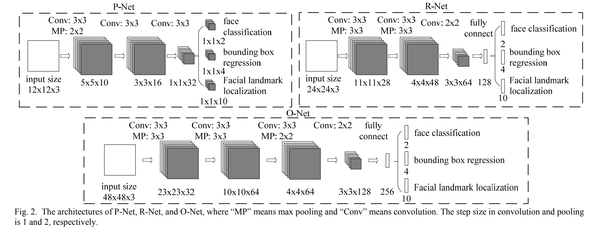
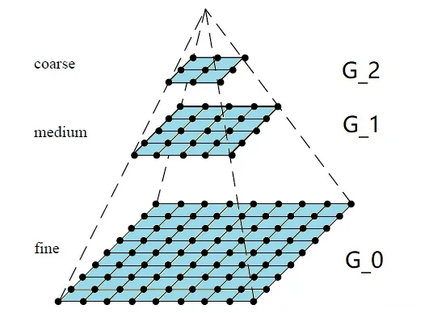
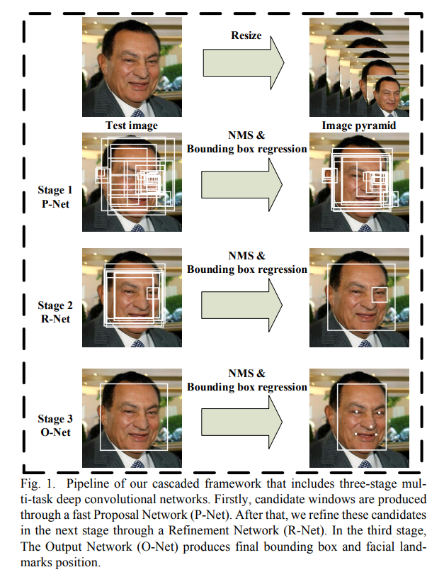

[TOC]

# MTCNN

MTCNN(Multi-Task Cascaded Convolutional Networks) : 多任务级联卷积神经网络，是人脸检测中应用较广的算法。

MTCNN主要使用三个级联网络，采用候选框加分类器的方式，进行快速高效的人脸检测。三个级联网络：

- P-Net：快速生成候选窗口
- R-Net：高精度候选窗口过滤选择
- O-Net：生成最终边界框和人脸关键点。

主要使用图像金字塔，边框回归，非最大值抑制（NMS）等技术

## 图像金字塔

底部最大分辨率的图像逐次下采样得到的一系列图像。人脸检测框的大小保持不变，通过对不同尺寸图像扫描，可以框出所有不同尺度的人脸。

高斯金字塔：

